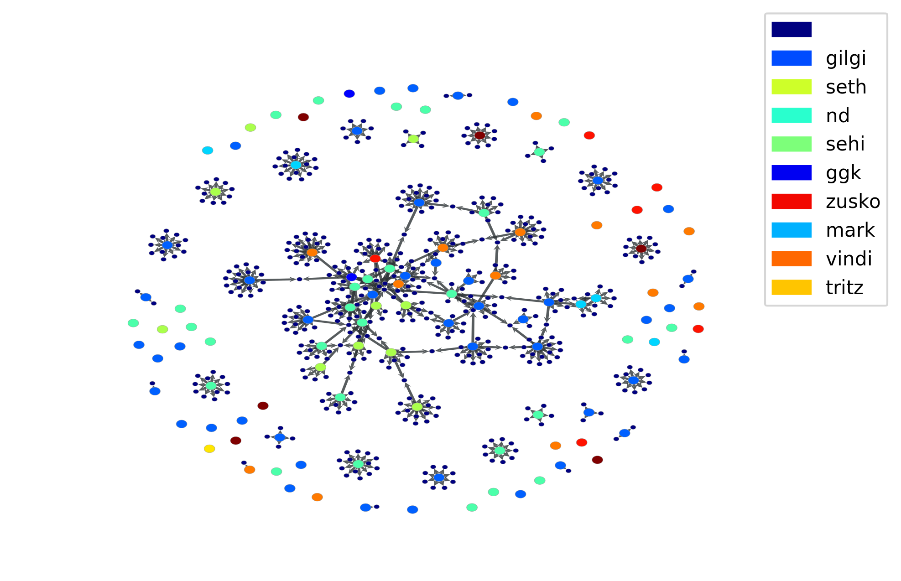

aotd-graph
==========

a graph visualization for "album of the day" selections

Basic usage example
-------------------

Construct a graph by running `build_graph.py`, then visualize it by running
`draw_graph.py`.

Premise
-------

The goal is to create a meaningful graph of albums (identified by YouTube URL),
so that algorithms "near" each other on the graph should be "similar."

Initially, every selected album is a vertex on the graph. How will we connect
similar albums in meaningful ways?

The idea is to scrape the YouTube URL's to get related URL's for each album, and
add a new vertex for each related album, with a corresponding new edge from the
album it was related to. Thus, edges in the graph signify that two albums are
similar enough that YouTube lists one as a related video from the other. These
"explored" albums are the small vertices in the image above.

By recursing deeper into the tree of related videos, we hope to eventually flesh
out the graph.

The final graph is rendered with a force-directed layout that should place
albums which are more closely connected (shorter path of related videos) or
more strongly connected (larger number of mutual related videos) closer
together.

### Caveats

Ideally, we want to explore regions of YouTube video space which represent
albums, not arbitary links such as cat videos. Therefore, we restrict our
exploration to videos which contain the substring "album" in their title.

Docker-specific notes
---------------------

### Docker setup instructions (for PyCharm)

  1. Install Docker
     - If Docker does not start, edit `C:\Windows\System32\drivers\etc\hosts`
       and add the machine name to a loopback IP (e.g., `::1  MY-COMPUTER-NAME`)
     - In the General tab of the Docker Settings window, check the option for
       "Expose daemon on tcp://localhost:2375 without TLS"
     - In the Shared Drives tab of the Docker Settings window, check the option
       for whatever drive you cloned this project into

  2. Pull the image from the Docker Cloud
  
         $ docker pull thomasgilgenast/aotd-graph

  3. Configure the Remote Interpreter
     - In PyCharm, under File > Settings, under Project Interpreter, click the
       gear and choose "Add Remote"
     - Select "Docker" from the radio buttons
     - Add a new Server if one doesn't exist yet (accept the defaults)
     - Select `thomasgilgenast/aotd-graph:latest` from the "Image name"
       dropdown
     - Change the "Python interpreter path" to `python3`
  
  4. Test the installation
     - Right-click `test.py` and choose "Run 'test'"
     - A new file `test.png` should appear in the project directory
     
     

### Running scripts against Docker without using PyCharm

You can always run scripts directly within a Docker container by mapping the
host directory containing this repo to `/aotd-graph` on the container.

For example:

    $ docker run -it -v <host directory>:/aotd-graph aotd-graph python3 build_graph.py
    $ docker run -it -v <host directory>:/aotd-graph aotd-graph python3 draw_graph.py

### Manually updating the Docker image

This should happen automatically for pushes to `master`, version tags, and for
PR's opened against this repo, but for posterity here is the "long way" to do
it.

  1. Edit the `Dockerfile`
  2. Re-build the container
  
         $ docker build -t aotd-graph .
  
  3. Tag the container with a new version number
  
         $ docker tag aotd-graph <docker username>/aotd-graph:<version>
  
  4. Push the new version to Docker cloud
  
         $ docker push <docker username>/aotd-graph:<version>
