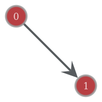

aotd-graph
==========

a graph visualization for "album of the day" selections

Docker setup instructions (for PyCharm)
---------------------------------------

  1. Install Docker
     - If Docker does not start, edit `C:\Windows\System32\drivers\etc\hosts`
       and add the machine name to a loopback IP (e.g., `::1  MY-COMPUTER-NAME`)
     - In the General tab of the Docker Settings window, check the option for
       "Expose daemon on tcp://localhost:2375 without TLS"
     - In the Shared Drives tab of the Docker Settings window, check the option
       for whatever drive you cloned this project into

  2. Pull the image from the Docker Cloud
  
         $ docker pull thomasgilgenast/aotd-graph

  3. Configure the Remote Interpreter
     - In PyCharm, under File > Settings, under Project Interpreter, click the
       gear and choose "Add Remote"
     - Select "Docker" from the radio buttons
     - Add a new Server if one doesn't exist yet (accept the defaults)
     - Select `thomasgilgenast/aotd-graph:latest` from the "Image name"
       dropdown
     - Change the "Python interpreter path" to `python3`
  
  4. Test the installation
     - Right-click `test.py` and choose "Run 'test'"
     - A new file `test.png` should appear in the project directory
     
     

Manually updating the Docker image
----------------------------------

This should happen automatically for pushes to `master`, version tags, and for
PR's opened against this repo, but for posterity here is the "long way" to do
it.

  1. Edit the `Dockerfile`
  2. Re-build the container
  
         $ docker build -t aotd-graph .
  
  3. Tag the container with a new version number
  
         $ docker tag aotd-graph <docker username>/aotd-graph:<version>
  
  4. Push the new version to Docker cloud
  
         $ docker push <docker username>/aotd-graph:<version>
